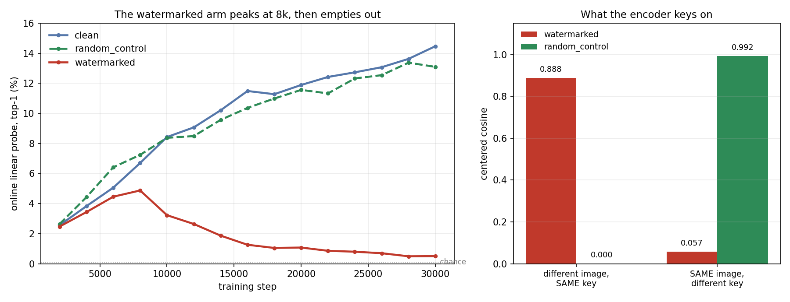

# Reproducing "The Obsessed Encoder" — LeJEPA case

An independent reproduction of the LeJEPA experiment from Enigma Labs'
[**The Obsessed Encoder**](https://www.enigma.inc/posts/obsessed-encoder): plant a faint,
*predictable* pattern in the training images of a published self-supervised recipe, and the
objective keeps improving while the representation empties out.

Their companion code is [Enigma-Incorporated/The-Obsessed-Encoder](https://github.com/Enigma-Incorporated/The-Obsessed-Encoder).
This repository is **not a copy of it** — it holds what you need to run it yourself on rented
hardware: measured cost, a provisioning script, a throughput harness, and my results.

Everything below was measured on an A100, not estimated.

---

## Status

| Phase | State |
|---|---|
| 0 · measure cost before spending | **done** — see [Cost](#cost-measured-not-guessed) |
| 1 · reproduce the three arms (1 seed, 30k steps) | **done** — see [Results](#results) |
| 2 · extend: contamination-fraction sweep | planned |

Results land in [`results/`](results/) as each arm finishes.

## The experiment

Three arms, identical but for the stimulus, at the repo's shipped operating point
(ViT-S/8 at 128px, batch 256, V=4, 30k steps with the LR cosine laid over a 200k horizon):

| Arm | Stimulus |
|---|---|
| `clean` | unmodified ImageNet-1k — the baseline |
| `watermarked` | one faint per-image pattern, tiled across the frame: a *predictable* feature every augmented view shares |
| `random_control` | identical renderer and identical per-tile energy, but a different pattern at every tile position — matched pixels, nothing predictable |

The control is the load-bearing arm. Without it the obvious objection is "you just added noise";
with it, the only difference between test and control is whether the pattern *repeats*.

## Cost (measured, not guessed)

Before renting anything for the full run, I measured seconds/step at the real operating point.
The method matters: each arm is run at two step counts and the **slope** is taken, so process
startup cancels instead of inflating a short run.

| Arm | s/step | 30k steps |
|---|---|---|
| `clean` | 0.550 | ~4.6 h |
| `watermarked` | 0.650 | ~5.4 h |
| `random_control` | 0.658 | ~5.5 h |

**~16 GPU-hours for one seed across three arms — about $17** on a $1.03/hr A100 80GB,
plus ~$1 for the 47 GB ImageNet-1k pull. Three seeds would be ~48 GPU-hours.

Two findings worth knowing before you rent:

- **Peak VRAM is 44.1 GB.** The upstream README says ~42. Either way this rules out 48 GB-class
  cards — an L40S listing at 45 GB will not fit it. 80 GB is the floor.
- **`num_workers=48` is *slower* than the shipped 16** (0.742 vs 0.658 s/step) — dataloader
  worker thrash, exactly as the upstream README warns. Don't "optimize" it upward.

Raw numbers: [`results/phase0_throughput.json`](results/phase0_throughput.json).

The Phase 0 figures were measured against a stand-in dataset with heavier decode than real
ImageNet-1k, making them deliberately conservative — and the full run bore that out: the `clean`
arm ran at **0.53 s/step** against the 0.550 predicted, finishing in 4.5 h against the 4.6 h
estimate.

## Reproduce it

Rent one on-demand GPU with **≥80 GB VRAM, ≥100 GB disk, ≥32 CPU cores**. On-demand, not
interruptible — see the warning below.

```bash
# on the box
bash provision/setup_vast.sh --data        # clone, uv sync, fetch + verify ImageNet-1k

cd /root/oe
export DATA_DIR=$PWD/data HF_HOME=$PWD/data/hf_cache RESULTS_DIR=$PWD/results
export WANDB_MODE=disabled PYTORCH_CUDA_ALLOC_CONF=expandable_segments:True

uv run python lejepa/additional_files/run.py --seeds 1 --gpus 0   # the three arms
uv run python lejepa/additional_files/run.py --plot-only          # figures
```

To measure throughput on your own hardware before committing to the full run:

```bash
bash bench/throughput.sh clean
bash bench/throughput.sh random_control
```

> **There is no resume.** The upstream minimal recipe has no checkpointing, so a killed run
> restarts from step 0 and loses that arm's work. Use on-demand instances. Completed *arms* are
> safe — the runner uses `summary.json` as a done-marker and skips them — so you can stop between
> arms and pick up later.

## Two upstream bugs found along the way

Both reported with fixes:

**1. The Imagenette path is broken on a fresh clone**
([PR #3](https://github.com/Enigma-Incorporated/The-Obsessed-Encoder/pull/3))

`prepare_data.py --dataset imagenette` fails with
`Revision 'refs/convert/parquet' doesn't exist`. The hub retired that dataset's auto-converted
parquet branch — `/api/datasets/frgfm/imagenette/refs` now returns `"converts": []` — and `main`
carries only the loading script, which `datasets` ≥3 will not execute. The repo had already moved
*from* the script *to* the conversion for that reason; both routes are now closed, which also makes
the documented fidelity anchor unreachable. Fix: fetch the 160px archive that repo's own script
declares (`fast-ai-imageclas/imagenette2-160.tgz`) — same images, same labels, sha256-pinned.

**2. No CI** ([PR #2](https://github.com/Enigma-Incorporated/The-Obsessed-Encoder/pull/2))

The repository's central claim is that every modification to vendored upstream code lives inside a
marked `# >>> obsessed-encoder` block, audited by hand via `VERIFYING.md`. I verified all three
audits reproduce exactly, then turned the document into an exit code: a checker that asserts the
recorded diff shapes *and* that every substantive changed line falls inside a marked block.

For what it's worth, I went looking for a bug in the science and did not find one — the watermark
renderer's energy matching survives clamp and uint8 quantization (the two arms stay within 1 % of
each other even on saturated images), and the paired-cosine pairing algebra is correct.

## Results

All three arms, one seed, 30k steps, ImageNet-1k, on a pristine checkout of
upstream `3781942` (`git_dirty: false`, recorded in each `summary.json` with
torch/CUDA/driver versions and the lockfile hash). Both A100-SXM4-80GB.

| Arm | final `test/acc` | final `train/lejepa` | wall-clock |
|---|---|---|---|
| `clean` | 14.47 % | 0.1265 | 4.5 h |
| `watermarked` | **0.51 %** | **0.0515** | 4.7 h |
| `random_control` | 13.10 % | 0.1270 | 4.3 h |



**The objective improved while the representation emptied out.** The
watermarked arm's training loss ends **2.5x lower** than the baseline's — by
its own objective it is the better model — while its online probe reads
0.51 % against the baseline's 14.47 %, on a task where chance is 0.1 %.

**And it is predictability, not pixels.** `random_control` uses the identical
renderer at identical per-tile energy, differing *only* in whether the pattern
repeats across the frame. It lands at 13.10 % with a loss of 0.1270 —
statistically the clean run. The same amount of added signal either collapses
the encoder or does nothing at all, depending solely on whether it is
predictable.

### The crossover

| step | 2k | 4k | 6k | **8k** | 12k | 16k | 20k | 24k | 28k | 30k |
|---|---|---|---|---|---|---|---|---|---|---|
| `clean` | 2.56 | 3.83 | 5.06 | 6.70 | 9.07 | 11.49 | 11.89 | 12.73 | 13.63 | **14.47** |
| `random_control` | 2.64 | 4.43 | 6.42 | 7.24 | 8.49 | 10.37 | 11.56 | 12.32 | 13.37 | **13.10** |
| `watermarked` | 2.48 | 3.44 | 4.46 | **4.87** | 2.64 | 1.26 | 1.08 | 0.80 | 0.50 | **0.51** |

(percent top-1)

The watermarked arm is not a model that failed to learn. It tracks the other
two for 8k steps, peaks at 4.87 %, then turns over and falls for the remaining
22k as the encoder discovers the watermark is cheaper to satisfy than image
content.

### What the encoder actually keys on

The decisive measurement is the paired-input cosine, not accuracy: render each
validation image with its own watermark key, then re-render it carrying a
*different* image's key, and compare representations.

| pairing | `watermarked` | `random_control` |
|---|---|---|
| different image, **same key** | **0.888** | 0.000 |
| same image, **different key** | **0.057** | **0.992** |
| null reference | −0.0001 | 0.00004 |

The two arms are mirror images. In the control the representation is invariant
to the key (0.992 for the same image under different keys) and carries no key
information at all (0.000) — exactly what a healthy encoder does. In the
watermarked arm the two numbers are **swapped**: two different pictures sharing
a key land in nearly the same place, and the same picture under two keys lands
nowhere near itself.

That is the takeover measured directly rather than inferred from an accuracy
drop.

Per-run outputs live in [`results/runs/`](results/runs/): `summary.json`
(final metrics + provenance), `eval_ticks.csv`, and the full per-step
`metrics.jsonl` the figure is rendered from.

<!-- RESULTS -->

## Layout

```
bench/throughput.sh        measure s/step for one arm (slope method)
provision/setup_vast.sh    bare CUDA box -> working checkout, optional data fetch
results/                   measurements and, as they land, run outputs
```

## Credit

The experiment, the code being reproduced, and the underlying idea are Enigma Labs':
[blog post](https://www.enigma.inc/posts/obsessed-encoder) ·
[code](https://github.com/Enigma-Incorporated/The-Obsessed-Encoder).
Upstream recipe: [LeJEPA](https://github.com/galilai-group/lejepa).
